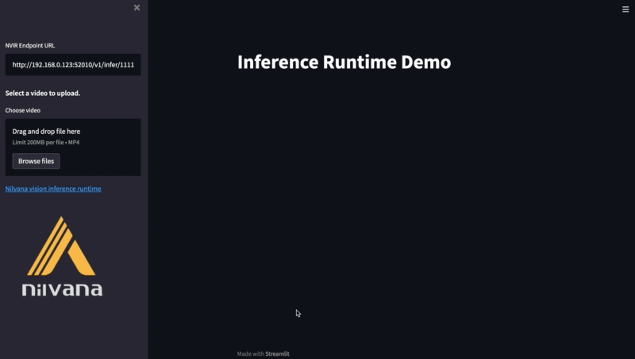

# nvir-streamlit-demo

This is a demo repo to demonstrate nilvana vision inference runtime with streamlit.

Please refer to the medium [article](https://medium.com/hello-nilvana/%E9%80%8F%E9%81%8E-streamlit-%E5%BF%AB%E9%80%9F%E5%BB%BA%E7%AB%8B%E7%89%A9%E9%AB%94%E5%81%B5%E6%B8%AC-web-app-b2b156d2f862). 👈👈👈👈👈👈

## Get Started

```python
python3 -m venv .venv
source .venv/bin/activate
pip3 install -r requirements.txt

streamlit run app.py    # video file
streamlit run webcam.py # webcam
```

## Demo Usage

|  |
|:--:|
| <b>Video with bounding boxes</b>|

## Assets

- Video by cottonbro from Pexels: https://www.pexels.com/video/woman-art-iphone-smartphone-3960181/
